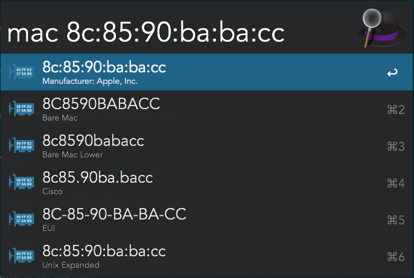

<h1 align="center">Mac Address Reformater 🌐</h1>

This repository provide a set of utility to help to convert MAC address in different formats for people working around Networking.

If you have to take Mac information from one source and search into another (log, CLI, etc), you often have to translate it into the format in which you have to search (which is by Murphy's law never the same as you current source). This tool aims to simplify this conversion.

This small utility is provided in several ways:

| Type                                          | Status |                                                              |
| --------------------------------------------- | ------ | ------------------------------------------------------------ |
| [Alfred](https://www.alfredapp.com/) Workflow | ✅      | [Install Workflow](MAC Address Formating.alfredworkflow)  [Source](alfred-mac-address-reformater) |
| Python Script                                 | 🔧      | [Source](python-mac-address-reformater/mac-address-reformater.py) |
| Executable Binary                             | 🔧      |                                                              |

## Alfred Workflow

Once the workflow installed ([Install Workflow](MAC Address Formating.alfredworkflow)), to use it you just have to type: **mac YOURMACADDRESS** (or copy paste the mac address after the mac keyword).

The list will then show you the different format converted. You can copy-paste it or just select the line chosen to have it directly in your clipboard.

Here is an exemple of the tool in action:

